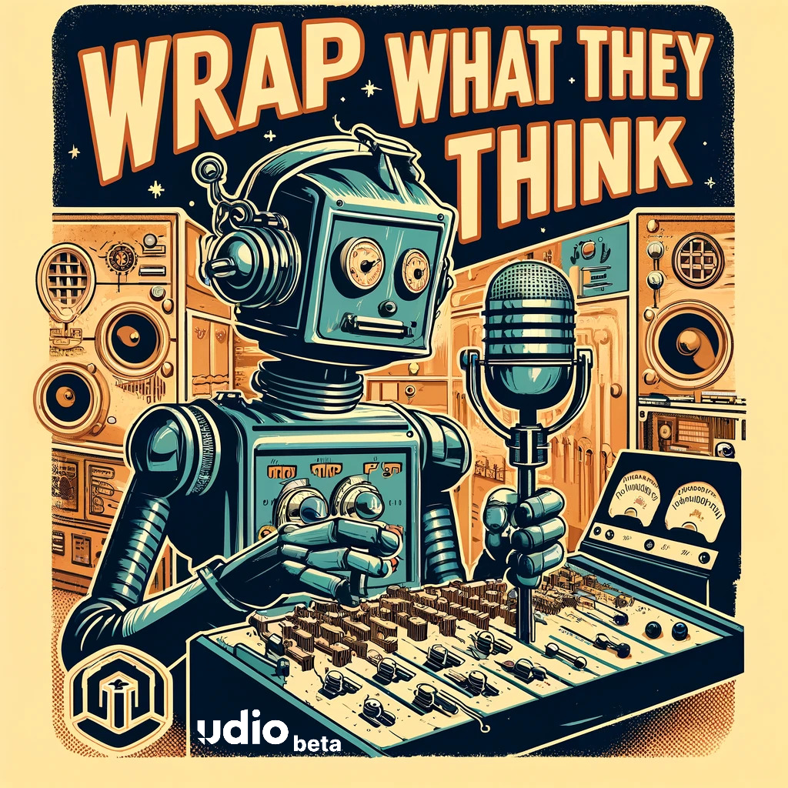

# Udio Wrapper



Written by @Flowese

<a href="https://colab.research.google.com/drive/11BqjonOql85BkB4tbxpI_lq2rfGkc60Y?usp=sharing" target="_blank"></a>

## Description

`udio_wrapper` is a Python package that allows you to generate music tracks from Udio's API using textual prompts. This package is designed to interact with Udio's API and is not officially endorsed by Udio.

## Advantages Over Other Models

Unlike other music generation models, Udio offers a unique feature of extending or conditioning new tracks based on existing ones, making it ideal for iterative and creative music production processes.

## Legal Disclaimer

This package is created for educational and research purposes. By using this package, you agree to do so at your own risk. This package is not affiliated, endorsed, or sponsored by Udio in any way.

## Requirements

- Python 3.x
- pip

## Installation

### From PyPI

To install the package from PyPI, run the following command:

```bash
pip install udio_wrapper
```

To upgrade the package from PyPI, run the following command:
```bash
pip install --upgrade --no-cache-dir udio_wrapper
```


### From GitHub Repository

To install the package directly from the GitHub repository, run:

```bash
pip install git+https://github.com/flowese/UdioWrapper.git
```

## Configuration

### Obtaining the Authorization Token

1. Sign up at [Udio](https://www.udio.com/).
2. Once registered, open your browser's inspector:
   - In Chrome: `Ctrl+Shift+I` or `F12` on Windows, `Cmd+Option+I` on Mac.
3. Go to the `Application` tab.
4. On the left panel, locate and click on `Cookies`, then select the Ideogram website.
5. Find the cookie named `sb-api-auth-token`.
6. Click on `sb-api-auth-token` and copy the value in the `Value` field.


### Usage

To use `udio_wrapper`, import the `UdioWrapper` class and provide the necessary parameters.

## Usage Examples

The following examples demonstrate various ways to use the `UdioWrapper` to generate music based on different scenarios:

Generating a Complete Song with Automatically Generated Lyrics
```python
from udio_wrapper import UdioWrapper

udio = UdioWrapper(auth_token="your_auth_token_here")
auto_song_url = udio.inference(
    original_prompt="A song about the wonders of nature",
    number_of_extensions=1,
    extend_prompt="Keep singing about the beauty of the forest",
    outro_prompt="Concluding with the serene sunset",
    save_to_disk=True
)
print(f"URL of the complete song with automatic lyrics: {auto_song_url}")

```

Generating a Complete Instrumental Song
```python
instrumental_song_url = udio.inference(
    original_prompt="Smooth jazz instrumental music",
    original_lyric_input="",
    number_of_extensions=1,
    extend_prompt="Continue the smooth jazz vibe",
    extend_lyric_input="",
    outro_prompt="Finish with a calming jazz outro",
    outro_lyric_input="",
    save_to_disk=True
)
print(f"URL of the complete instrumental song: {instrumental_song_url}")

```

Generating a Complete Song with Custom Lyrics
```python
custom_lyric_song_url = udio.inference(
    original_prompt="A ballad about lost love",
    original_lyric_input="Here under the moonlight, I remember your smile",
    number_of_extensions=1,
    extend_prompt="Continuing the tale of our summer love",
    extend_lyric_input="Now all I have is the echo of your laughter",
    outro_prompt="Ending our story as the leaves begin to fall",
    outro_lyric_input="Farewell my love, until we meet again",
    save_to_disk=True
)
print(f"URL of the complete song with custom lyrics: {custom_lyric_song_url}")

```

Generating a Simple Song with Custom Lyrics (No Extensions or Outro)
```python
simple_custom_lyric_song_url = udio.inference(
    original_prompt="A pop song about bright city nights",
    original_lyric_input="Neon lights and lonely hearts",
    save_to_disk=True
)
print(f"URL of the simple song with custom lyrics: {simple_custom_lyric_song_url}")

```

Generating a Simple Instrumental Song (No Extensions or Outro)
```python
simple_instrumental_song_url = udio.inference(
    original_prompt="Classical piano piece in minor key",
    original_lyric_input="",
    save_to_disk=True
)
print(f"URL of the simple instrumental song: {simple_instrumental_song_url}")

```


#### Parameters

Each parameter in the `UdioWrapper` inference method has a specific purpose for creating customized music tracks:

- **`auth_token`** *(Required)*: The authorization token you obtained from Udio, which is necessary for authenticating and making API requests.

- **`original_prompt`** *(Required)*: The initial textual prompt that sets the thematic direction for generating the first track. This is the creative seed from which the song is grown.

- **`original_lyric_input`** *(Optional)*: Specifies the lyrics for the initial track. If provided as an empty string (`""`), the resulting song will be purely instrumental. If omitted, Udio's API will automatically generate lyrics based on the `original_prompt`.

- **`number_of_extensions`** *(Optional)*: The number of times the initial track should be extended. Each extension will be based on the last segment of the music generated in the previous step. The default value is 0, which means no extensions.

- **`extend_prompt`** *(Optional)*: The textual prompt for each extension phase. This prompt should ideally continue the theme or style set by the `original_prompt`.

- **`extend_lyric_input`** *(Optional)*: Custom lyrics for each extension phase. If this parameter is set to an empty string, the extension will be instrumental. If omitted, the API will automatically generate lyrics that attempt to continue the thematic content of the song.

- **`outro_prompt`** *(Optional)*: The textual prompt for the outro of the song, providing a thematic and musical conclusion.

- **`outro_lyric_input`** *(Optional)*: Custom lyrics for the outro. If provided as an empty string, the outro will be instrumental. If omitted, the API will generate lyrics that cap off the song's narrative.

- **`save_to_disk`** *(Optional)*: A boolean indicating whether to save the generated tracks to the disk. The default is `True`, which means the tracks will be saved.

These parameters allow full customization of the music generation process, from the initial creation through extensions to the final outro, giving users the ability to tailor both the music and lyrics to fit their specific needs or artistic vision.


## License

This project is licensed under the MIT License.

## Contributing

If you'd like to contribute to this project, feel free to fork the repository and send a pull request, or open an issue to discuss what you'd like to change. All contributions are welcome!

## TODO

### Pending Tasks and Features

- Improve error handling and response validation.
- Implement a user-friendly web interface for easier interaction with the API.

-----
